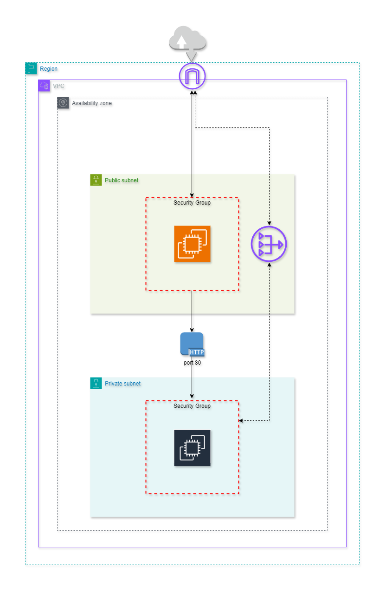

# Awesome AWS Infrastructure Setup! 🚀

Welcome to my Terraform repository for setting up infrastructure on AWS. Let's take a tour of what I've got here:

## What's Inside? 🏗️

My setup includes:

### Virtual Private Cloud (VPC) 🌐

- **What is it?** It's like your own private piece of the internet!
- **Features:** Default tenancy, nice and spacious at `10.0.0.0/16`
- **Tags:** Created with love by Terraform 😊

### Subnets 🔌

- **Private Subnet:** A cozy corner for my private stuff
- **Public Subnet:** Where the world can peek in (but not too much!)

### Gateways and Routes 🛣️

- **Internet Gateway:** My bridge to the big, wide internet 🌍
- **NAT Gateway:** Secretly lets private stuff talk to the internet 😎
- **Route Tables:** Making sure my traffic goes where it should 🚦

### Instances 💻

- **Private EC2 Instance:** My workhorse for private tasks 🛠️
- **Bastian EC2 Instance:** Meet my friendly public face! 🤖

### Security Stuff 🔒

- **Security Groups:** Like bouncers for my instances 🕶️
- **Key Pair:** My secret key to access the instances 🔑

## Fun Extras 🎉

- **TLS Private Key:** It's a secret... shh! 🤫
- **Elastic IP:** Gives my Bastian instance a cool, fixed address 🌟
- **Private Key PEM File:** A secret file just for me! 📜

## Usage 🛠️

To apply this infrastructure setup to your system, follow these steps:

1. **Clone the Repository:** Start by cloning this repository to your local machine. 📥

2. **Set Up AWS Credentials:** Ensure you have AWS credentials configured on your system, either by exporting them as environment variables or using AWS CLI configuration. 🔑

3. **Customize Configuration:** Modify the `terraform.tfvars` file to match your requirements, including region and availability zones. 🛠️

4. **Initialize Terraform:** Run `terraform init` in your terminal to initialize Terraform and download necessary plugins. 🔄

5. **Preview Changes:** Use `terraform plan` to see what Terraform plans to create, modify, or destroy. 📝

6. **Apply Changes:** Once satisfied with the plan, execute `terraform apply` to create the infrastructure on AWS. 🚀

7. **Enjoy Your AWS Setup:** Voila! Your AWS infrastructure is now up and running. 🎉

8. **SSH into the Public Bastian Host:** Use the public IP printed in the output to SSH into the Bastian EC2 instance. 🖥️

9. **Get the Private IP of the Host in the Private Subnet:** Once logged into the Bastian instance, retrieve the private IP address of the host in the private subnet. 🕵️‍♂️

10. **Download index.html Using Wget:** Try using wget to download the index.html file from the private IP address. You should see the file downloaded onto the Bastian instance. (Example: `wget private_ip:80`) 📥

Remember to manage your infrastructure responsibly and destroy resources when they are no longer needed to avoid unnecessary costs. ♻️

That's it! Have fun exploring my awesome setup! If you need anything, just give me a shout! 😊